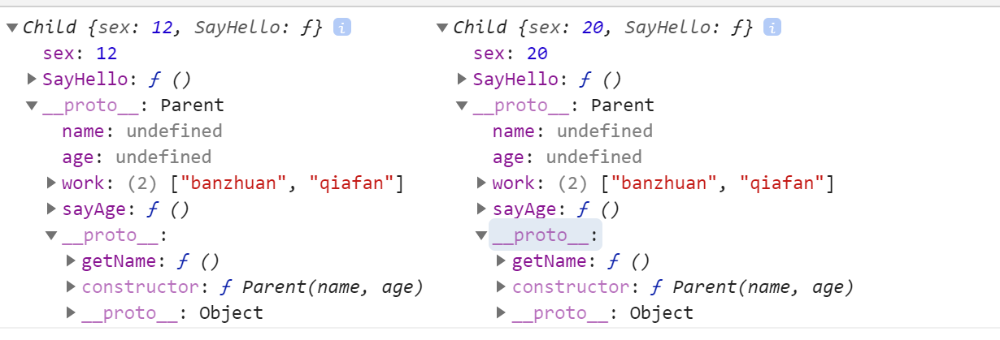

## 继承

    A对象通过继承B对象，就能直接拥有B对象的所有属性和方法

### 继承的六种方式

*  原型链继承

    该方法实现的本质是通过将子类的原型指向了父类的实例，所以**子类的实例就可以通过_proto_访问到Child.prototype也就是Parent的实例，这样就可以访问到父类的私有方法，然后再通过_proto_指向父类的prototype就可以获取到父类原型的方法**
    

    

    
